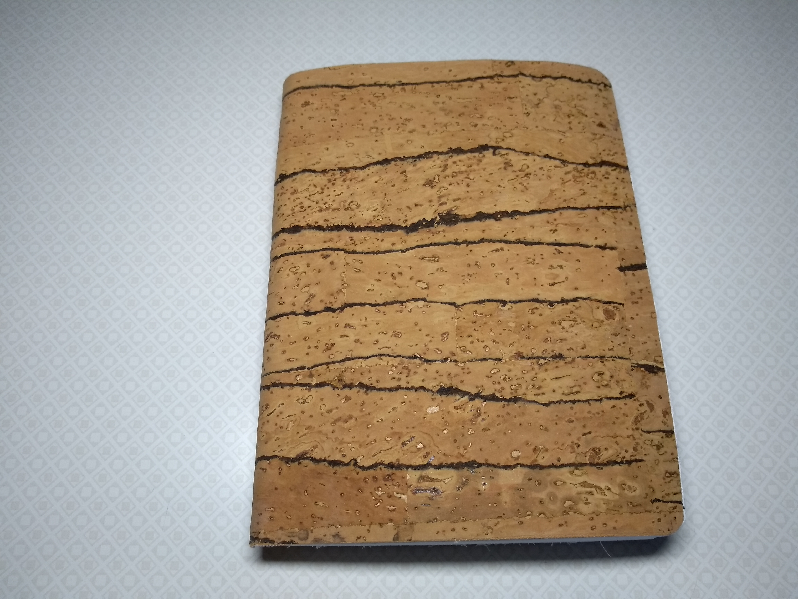

# Notebook

## About

I'm making notebooks. As a hobby. And I figured, why not make them open source.

In a literal sense, a notebook isn't hardware. But this is still an open hardware product, in the sense of ["anything physical that has public source files"][OSHWA FAQ]. I plan to include all information that is required to build these notebooks in this repository. Starting with tools used, materials and how to source them, and build instructions. The designs of any custom tools I make will also be open source.

[OSHWA FAQ]: https://www.oshwa.org/faq/

## Documentation

The following documentation is already available:

- Tools: [`documentation/tools.md`](documentation/tools.md)
- Materials: [`documentation/materials.md`](documentation/materials.md)
- Build process: [`documentation/build-process.md`](documentation/build-process.md)

## License

This project is open source, licensed under the terms of the [Zero Clause BSD License] (0BSD, for short), with the addition that the word "software", as used in the license, refers to all copyrighted material in the [`documentation/`](documentation) folder.

This basically means you can do anything with this project, without any restrictions, but you can't hold the authors liable for problems.

See [LICENSE.md] for more details.

[Zero Clause BSD License]: https://opensource.org/licenses/0BSD
[LICENSE.md]: https://github.com/hannobraun/fornjot/blob/main/LICENSE.md
