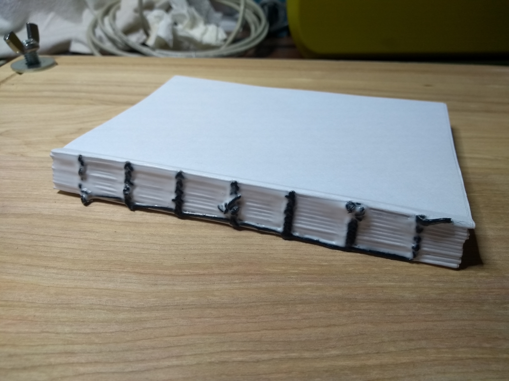

# Work Log

I have a daily habit of working on side projects. These projects used to be all software, and I made sure to make at least one useful commit every single day.

As I move more into physical projects, this doesn't work as well. But I do really like that daily commit as a way to track my habit, and I've decided I want to keep it. Hence this work log. Whenever I do work on this project that otherwise wouldn't result in a commit to this repository, I document it here.

## 2022-02-06

Started working on notebook #3. Finished sewing the text block.

## 2022-02-01

Ordered more cork (my initial order lasted for 2 notebooks). Did research about materials I can use for the bookmark, and some kind of flexible ribbon to keep the notebook closed, but couldn't find anything I was happy with.

## 2022-01-30

Finished notebook #2.

## 2022-01-29

Finished sewing and glueing notebook #2.

## 2022-01-23

Finished the signatures for notebook #2. Should be ready for sewing.

## 2022-01-22

Worked on creating the signatures for notebook #2. Spent a lot of extra time because I did the operations in the wrong order.
